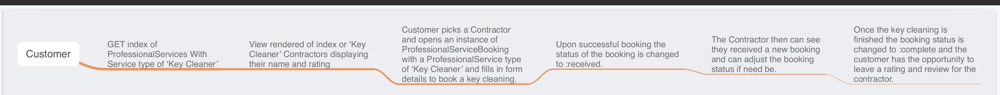

# Key Me Engineering Homework

## Problem 1:

  ### A. Dog::play_nice. Doesn't quite do what the comment describes. There's a bug. Can you spot it?
```ruby
  # Takes a list of up to three dogs and determine whether they'll play nice.
  # Dogs of highly varied weights can't play nice together,and groups with
  # too many puppies and large dogs don't play nice either.
```
The comment says "groups with too many puppies and large dogs don't play nice either."

This is slightly confusing given that the method accepts 3 dogs there is no way you could have a group of "many puppies" AND "large dogs".

Unless this is just implying that "large dogs don't go well with many puppies" in this case you could have have one large dog and two puppies and that would fulfill the case of dogs that would not play nice.

Going further with this for the block that addresses the too_many_puppies case it accepts an amount of puppies greater then or equal too 2.

This means you could have all 3 dogs be puppies and that should be too many puppies together and therefore you should get a response that reports that they cannot play nice together because they are all puppies.

And where the issue further arises is in the elsif statement towards the end of #play_nice. The logic is saying that in order for the method to return "These pups are too rambunctious to place*** (found a typo here just now) nice together." then the following TWO conditions must be met:

    1. There must be 2 or more puppies with an age less then 5
    2. AND there must be big_dogs (a dog with a weight above 60).

Now the issue with this is: You could have 3 puppies which technically is too_many_puppies; but you would still need one of those puppies to be a big_dogs (dog with a weight above 60) in order for it to return the statement above ("These pups are too rambunctious...").

  #### - Give example values for the arguments that expose the bug (i.e. hit an unexpected error).

Examples that support this:

	Example One:
 ```ruby
	dog_1 = Dog.new({:name => "Zoe", :age => 4, :weight => 16})
	dog_2 = Dog.new({:name => "Saddie", :age => 4, :weight => 7})
	dog_3 = Dog.new({:name => "Gus", :age => 2, :weight => 4})
	Dog.play_nice(dog_1, dog_2, dog_3)
  ```
    # => "Sure, they'll play nice!"

The three dogs are below the age of 5 which qualifies all of them as puppies meeting condition one. Therefore if too_many_puppies to play nice is >= 2 then this should NOT return that they would play nice together. BUT because one of the dogs is NOT above the weight of 60 the condition does not go through.

	Example Two:
  ```ruby
	dog_1 = Dog.new({:name => "Zoe", :age => 4, :weight => 55})
	dog_2 = Dog.new({:name => "Saddie", :age => 7, :weight => 55})
	dog_3 = Dog.new({:name => "Gus", :age => 2, :weight => 61})
	Dog.play_nice(dog_1, dog_2, dog_3)
  ```
	# => "These pups are too rambunctious to place nice together."

In this example both too_many_puppies exist (dog_1 and dog_2) and there is a big_dog above the weight of 60, therefore both conditions are met and the returned statement is that they are to rambunctious to play together.

  #### - Edit the method to fix the bug. Explain how the fix works.

```ruby
    def self.play_nice(dog_one=nil, dog_two=nil, dog_three=nil)
      dogs = [dog_one, dog_two, dog_three]

      weights = dogs.map(&:weight)
      heaviest = dogs[weights.index(weights.max)]
      lightest = dogs[weights.index(weights.min)]
      big_dog = heaviest.weight > 60

      too_many_puppies = dogs.count do |dog|
        dog.age < 5
      end >= 2

      if heaviest.weight - lightest.weight > 20
        "#{heaviest.name} is too large to play nice with little #{lightest.name}."
      elsif too_many_puppies && big_dog
        "There are too many pups to play with a dog as plump as #{heaviest.name}."
      elsif too_many_puppies
        "These pups are too rambunctious to play nice together."
      else
        "Sure, they'll play nice!"
      end
    end
```

I changed big_dogs to big_dog and then added an additional elsif branch below too_many_puppies && big dog.

I also changed the returned statement to clarify that there are both too many pups and that there is a dog that is too big to play with those "too_many_puppies". This way you could get the edge case of having all 3 dogs be puppies which would be too many to play together even if there isn't a big_dog.

  ### B. Add comments to each line of code explaining what it does in your own words.

```ruby
class Dog
```
 creates the class Dog
```ruby
attr_accessor :age, :name, :weight
```
 Assigns the class Dog, the symbols :age, :name, and :weight.
 These symbols can be assigned values upon initialization of the instance of the class and later the value of that attr_accessor can be referenced and changed (because it is an attr_accessor and not a attr_reader which cannot be changed) by using the . operator after the instance of the Dog class followed by the attr_accessor without the colon ex: my_dog.age #=> 12.

```ruby
def initialize(params)
```
  Opens the start of a method declaration and states that it must recieve one argument in the place of the parameter 'params' which will be a hash of key value pairs.

```ruby
@name = params[:name]
```
  assigns an instance variable @name the value of the argument value of params[:name].

```ruby
@age = params[:age]
```
  assigns an instance variable @age the value of the argument value of params[:age]

```ruby
@weight = params[:weight]
```
   assigns an instance variable @weight the value of the argument value of params[:weight]

```ruby
end
```
 closes out the scope of the #initialize method for the Dog class

```ruby
def self.play_nice(dog_one=nil, dog_two=nil, dog_three=nil)
```

   Opens the start of a singleton method for the Class Dog, this means that the method can only be called by referencing the class Dog first similar to if you initialized a new instance of the dog class you would call Dog.new(params_here) in this case you would call Dog.play_nice(params_here). Play_nice takes 3 arguments dog_one, dog_two, and dog_three and by default they are all assigned a value of nil, this allows you to call the method without assigning all three arguments in the method call.

```ruby
dogs = [dog_one, dog_two, dog_three]
```
  This takes the 3 dog arguments and stores them in an array called dogs.
```ruby
weights = dogs.map(&:weight)
```
   This takes the dogs array and maps a method in the form of a symbol :wieght (as long as that method doesn't reguire any arguments) to each object in the array with the & operator and in this case the method is calling the attr_accessor :weight on each object in the dogs array. As a result this will return a new array of weight values of each dog in the dogs array.

```ruby
heaviest = dogs[weights.index(weights.max)]
```
   weights.index(weights.max) returns the index of the highest value within the array weights. That index is then passed into the dogs array to reference the dog object that is in that index of the dogs array.

```ruby
lightest = dogs[weights.index(weights.min)]
```

   weights.index(weights.min) returns the lowest value within the array wieghts. That index is then passed into the dogs array to reference the dog object that is in that index of the dogs array.

```ruby
big_dogs = heaviest.weight > 60
```

this assigns the big_dogs variable to the heaviest dogs wieght IF its wieght is greater then 60.

```ruby
too_many_puppies = dogs.count do |dog|
  dog.age < 5
end >= 2
```

  this assigns too_many_puppies to a block of code that counts each 'dog' with an age LESS THEN 5 AND only IF there are GREATER THEN or EQUAL TO 2 dogs that meet that condition.

```ruby
if heaviest.weight - lightest.weight > 20
  "#{heaviest.name} is too large to play nice with little #{lightest.name}."
```
 this if statment returns a string with embedded ruby code of the the name of the heaviest weighing dog's name and the name of the lightest dog's name and concactinating the string to return that 'the heaviest dog is to large to large to play with the lightest dog' this gets returned ONLY IF the difference between the heaviest and lightests dogs wieght is > then 20

```ruby
elsif too_many_puppies && big_dogs
  "These pups are too rambunctious to place nice together."
```
  If the difference between the heaviest and lightest dog's weight is not > 20 BUT BOTH too_many_puppies is TRUE and big_dogs is TRUE then returns "These pups are too rambunctious..."

```ruby
else
  "Sure, they'll play nice!"
```

  If niether the first if statment nor the elsif statement evaluate to true then the else statment will return "Sure, they'll play nice!"

```ruby
end
```
  closes out the scope of the conditional block

```ruby
end
```

 closes out the scope of the Dog singleton_method #play_nice

```ruby
end
```
closes out the scope of the class Dog

  #### C. What would be the effect of switching the if and elsif clauses, so that the last lines of the method read like this instead?

```ruby
    if too_many_puppies && big_dogs
      "These pups are too rambunctious to place nice together."
    elsif heaviest.weight - lightest.weight > 20
      "#{heaviest.name} is too large to play nice with little #{lightest.name}."
    else
      "Sure, they'll play nice!"
    end
```
In this case if too_many_puppies AND big_dogs both evaluate to true AND the difference of the weight of the heaviest and lightest dog is greater then 20 the returned statement will ALWAYS be "These pups are too rambunctious to play nice together".

Where this could be an issue is if you always wanted to report the heaviest dog is to large for the smallest if there is a 20 lb difference then with this changed code you would run into cases that would be missed and result in returning "These pups are too rambunctious to play nice together." instead.

  #### D. Write a new method that generalizes this one to work for an arbitrarily large list of dogs.

  ```ruby
 def self.play_nice?(*dogs)
    weights = dogs.map(&:weight)

    heaviest = dogs[weights.index(weights.max)]
    lightest = dogs[weights.index(weights.min)]

    foul_play = heaviest.weight - lightest.weight > 20
    too_many_puppies = dogs.count { |dog| dog.age < 5 } >= 2
    too_many_pups_with_big_dog = heaviest.weight > 60 && too_many_puppies

    if foul_play
      "#{heaviest.name} is too large to play nice with little #{lightest.name}."
    elsif too_many_pups_with_big_dog
      "There are too many pups to play with a dog as plump as #{heaviest.name}."
    elsif  too_many_puppies
      "These pups are too rambunctious to play nice together."
    else
      "Sure, they'll play nice!"
    end
 end
  ```
## Problem 2:

Keyme's userbase is begging for a new service that would send someone to their house to keep all of the keys they've purchased shiny and new looking. Keyme is excited to provide such a vital service.

Assuming that Keyme already has a thriving services business that deals with contractors, how would you set this new service up.

  #### 1. Make assumptions about the current schema of Key Me's database:

    ∘ Add a new Professional Service type by extending Key Me's ProfessionalService class.
    ∘ Add the required elements you think would be necessary to distinguish this new service from the other services Key Me already provides.
    ∘ Update Key Me's Contractor class to handle multiple types of contractors. Assume that Key Me currently has only one type of contractor.
    ∘ Add a new Professional Service Booking type by extending Key Me's ProfessionalServiceBooking class.
    ∘ Add the required elements you think would be necessary to distinguish the booking of a "key cleaning" service from other bookings Key Me already provides.

#### ProfessionalService class
    ∘ UNIQUE_ID: INT
    ∘ type: STRING
    ∘ has_many: Contractors

#### Contractor class
    ∘ UNIQUE_ID: INT
    ∘ belongs_to: ProfessionalService
    ∘ has_many: ProfessionalServiceBookings
    ∘ has_many: ContractorReviews
    ∘ name: STRING

#### ProfessionalServiceBooking class
    ∘ UNIQUE_ID: INT
    ∘ belongs_to: Customer
    ∘ has_one: Contractor
    ∘ has_one: ServiceStatus


#### ServiceStatus class
    ∘ belongs_to: ProfessionalServiceBooking class
    ∘ status: STRING

#### ContractorReview class
    ∘ belongs_to: Contractor
    ∘ review: STRING
    ∘ rating: IN


#### 2. Flowchart the end-to-end system that would be required to:
    • Intake a key cleaning request:
      ∘ finding a key cleaner
      ∘ dispatching a key cleaner
      ∘ recording status updates from the key cleaner
      ∘ And tracking ratings for a key cleaner.

This does not need to include payment elements, but add that piece in if you're comfortable. This is a flowchart. This is not code.



#### 3. While you were coding this incredible new "key cleaning" service for the users of Keyme, you noticed that some developers use "cancelled" as a status, while other developers use "canceled."

You know that "cancelled" is a British spelling for the past tense of "cancel," so you want to clean up these divergences in a particularly American fashion.

• How would you go about finding all of errant "cancelled"s?

  First to check for all the cases of "cancelled's" I would do the following using grep:

    $ git grep 'cancelled'

• How would you group these changes as to best prevent git conflicts?

  Then before makeing the changes I would branch off of the current branch.

  Then do the following to substitute all cases of 'cancelled for canceled' globally in all the files of the git repo with sed.

    $ sed -i 's/cancelled/canceled/g' $(git ls-files)

• What would be your patriotic git commit message?

    $ git add --all
    $ git commit -m '1776.'